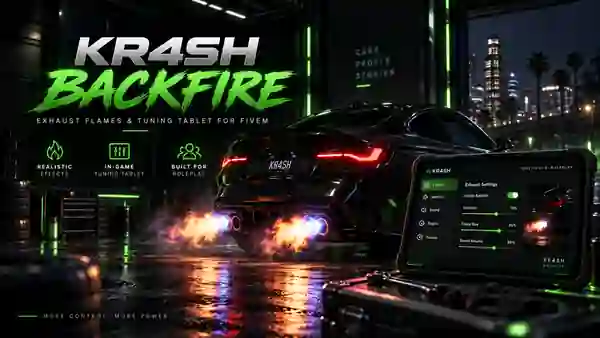

  

    

  **A configurable vehicle backfire system with an in-game tuning tablet for FiveM.**

  
  
  

  [**Download ZIP**](https://github.com/Krash-Scripts/Krash-Backfire-/blob/main/k_backfire.zip) · [Installation](docs/INSTALLATION.md) · [Troubleshooting](docs/TROUBLESHOOTING.md) · [Report an issue](https://github.com/Krash-Scripts/Krash-Backfire-/issues)

---

## Overview

KR4SH Backfire lets players install and configure exhaust effects on eligible vehicles. The in-game tablet brings vehicle-specific tuning, audio controls and persistent settings into one interface. Server owners can adjust prices, supported vehicles and the available presets in the resource configuration.

This repository currently distributes the resource as **[`k_backfire.zip`](k_backfire.zip)**. Extract the archive to install it; the root of this repository is not a browsable copy of the Lua/NUI source. Check the archive contents and the companion-resource requirements in the [installation guide](docs/INSTALLATION.md) before deployment.

## Features

| System | What it does |
| :--- | :--- |
| **Tuning tablet** | Configure the system through a dedicated in-game interface. |
| **Backfire profiles** | Choose from Subtle, Street and Race frequency presets. |
| **Exhaust effects** | Select flame color and size; includes a stationary launch-control effect. |
| **Sound options** | Select shot sounds, adjust volume and browse engine sound mappings. Compatible engine sound assets are required for playback. |
| **Vehicle persistence** | Saves installation, selected options and power state per license plate. |
| **Economy integration** | Configurable installation and upgrade prices, with ESX cash/bank support. |
| **Access controls** | Configurable driver, vehicle ownership and eligibility checks for purchases and changes. |

> Available options depend on your configuration and installed audio/particle resources. The presence of a sound in the catalog does not guarantee that a compatible sound bank is installed.

## Requirements

| Dependency | Purpose |
| :--- | :--- |
| ESX Legacy (`es_extended`) | Framework, vehicle ownership and payments |
| `ox_lib` | Library functions and notifications |
| `ox_inventory` | Usable tuning tablet item |
| `oxmysql` + MySQL | Persistent vehicle configurations |
| OneSync | Networked vehicle handling |
| `kr_backfire_fx` | Required custom particle resource |
| `Audio_Pack` | Compatible engine sound resource |

**Compatibility:** ESX Legacy. QBCore, Qbox and standalone integrations are not provided by this release. Make sure you have the right to redistribute any third-party audio or particle assets you include in your own packages.

## Installation

1. [Download `k_backfire.zip`](k_backfire.zip) and inspect the extracted resource folders. A complete configured installation expects `k_backfire`, `kr_backfire_fx` and `Audio_Pack`; verify whether companion resources are present and obtain properly licensed copies when needed.
2. Install the dependencies above and import `k_backfire/sql/install.sql` into your ESX database.
3. Register `backfire_tablet` in `ox_inventory` using the **`k_backfire.openTablet`** export. The item must not be consumed on use.
4. Start the dependencies and companion resources before `k_backfire`.

The exact item definition, startup order, upgrade notes and a verification checklist are in the **[installation guide →](docs/INSTALLATION.md)**. Follow those steps rather than relying on this short overview.

## Configuration

Most server settings are in `k_backfire/config.lua` inside the archive. They include access checks, in-game pricing, vehicle restrictions, frequency presets, flame options, audio dependencies and synchronization distances. Back up your configuration and database before updating.

The default player flow is simple: enter an eligible owned vehicle as the driver, stop, use the tablet, choose options and confirm the displayed in-game cost. The system's ON/OFF state is stored per vehicle.

## Documentation & support

| Resource | Link |
| :--- | :--- |
| Installation and updating | [Installation guide](docs/INSTALLATION.md) |
| Common errors | [Troubleshooting](docs/TROUBLESHOOTING.md) |
| Version notes | [Changelog](CHANGELOG.md) |
| Bug reports | [GitHub Issues](https://github.com/Krash-Scripts/Krash-Backfire-/issues/new/choose) |

When reporting an issue, include your resource versions, server/client console errors, steps to reproduce and the affected vehicle model. **Do not post server license keys, passwords or database credentials.**

---

  KR4SH Scripts · FiveM resource · Not affiliated with Rockstar Games or Cfx.re.

